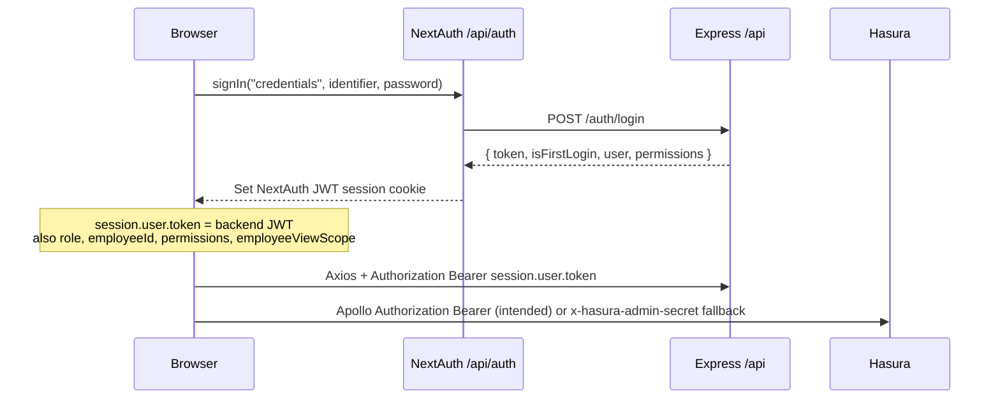

# Frontend Audit — Next.js HRMS → Flutter Rebuild Inventory

**Repo:** `frontend/` (Next.js 16 App Router, React 19)  
**Product direction:** Rebuild UI in Flutter for NB Developer CRM+HRMS+ERP  
**Scope of this doc:** Inventory only — no Flutter scaffolding, no backend/DB changes  
**Date:** 2026-07-15  
**Canonical API base:** `NEXT_PUBLIC_API_URL` (default `http://127.0.0.1:4000/api`)  
**Hasura:** `NEXT_PUBLIC_HASURA_URL` (default `http://localhost:8080/v1/graphql`)  
**REST envelope (typical):** `{ success, data, error? }` — clients read `res.data.data`

---

## Stack snapshot

| Concern | Library |
|---|---|
| Routing | Next.js App Router (`app/`) — route groups `(auth)`, `(employee)`, `(approver)` do **not** appear in URLs |
| Auth | NextAuth v4 (Credentials + JWT session) |
| REST | Axios (`lib/axios.ts`) + TanStack Query |
| GraphQL | Apollo Client 4 → Hasura |
| Forms | react-hook-form + Zod validators |
| UI | Tailwind + shadcn/Radix |
| Global client state | **No** Zustand/Redux/Jotai — SessionProvider + TanStack cache + Apollo cache |

---

## 1. Route inventory (all pages)

### 1.1 Auth

| Route | Module | View type | Notes |
|---|---|---|---|
| `/` | Landing | Marketing / entry | Links to Login / Admin; RSC |
| `/login` | Auth | Auth page | Active form: `modules/auth/components/LoginForm` |
| `/change-password` | Auth | Auth page | First-login password change |

Orphan (unused) duplicates: `app/(auth)/login/login-form.tsx`, `app/(auth)/change-password/change-password-form.tsx`.

### 1.2 Employee portal `(employee)`

| Route | Module | View type |
|---|---|---|
| `/dashboard` | Employee home | Dashboard (soft role redirects) |
| `/profile` | Employee Info (view) | Detail (tabbed) |
| `/profile/edit` | Employee Info (edit) | Detail/edit (tabbed; GraphQL-heavy) |
| `/attendance` | Attendance (self) | Detail / calendar |
| `/leave` | Leave (self) | Dashboard / balances hub |
| `/leave/apply` | Leave (self) | Form |
| `/leave/history` | Leave (self) | List |

Layout: `(employee)/layout.tsx` — **no auth gate** (client shell only).

### 1.3 Approver portal `(approver)`

| Route | Module | View type |
|---|---|---|
| `/approvals` | Leave approvals | List + actions |
| `/approvals/history` | Leave approvals | List (history) |

Layout: session required → `/login`; **does not** enforce `LEAVE/APPROVE`.

### 1.4 Admin portal `admin/`

| Route | Module | View type |
|---|---|---|
| `/admin` | — | Redirect → `/admin/dashboard` |
| `/admin/dashboard` | Admin overview | Dashboard |
| `/admin/employees` | Workforce / Employee Info | List |
| `/admin/employees/[id]` | Employee Info (full HR view) | Detail/edit (tabs) |
| `/admin/users` | User management | List + dialogs |
| `/admin/roles` | Role management | List |
| `/admin/roles/[id]` | Role / permission matrix | Detail/edit |
| `/admin/institutes` | Institutes / org | List |
| `/admin/institutes/[id]` | Institutes | Detail (members) |
| `/admin/designations` | Designations + alias accounts | List / forms |
| `/admin/position-slots` | Designations (legacy) | Redirect → `/admin/designations#alias-accounts` |
| `/admin/attendance` | Attendance (org) | Admin calendar / punches |
| `/admin/approvals` | Profile change-request approvals | List + approve/reject |
| `/admin/leaves` | Leave (admin queue) | List + filters + apply-for-employee |
| `/admin/leaves/pending` | Leave pending | List + approve/reject |
| `/admin/leaves/settings` | Leave policy / types | Settings forms |
| `/admin/leaves/holidays` | Public holidays | List + CRUD |
| `/admin/salary/commissions` | Salary / pay commissions | List |
| `/admin/salary/commissions/[id]` | Salary / pay commissions | Detail/edit columns |
| `/admin/salary/structures` | Salary structure templates | List / matrix |
| `/admin/salary/structures/[designationId]/[commission]` | Salary rules editor | Detail/edit |
| `/admin/salary/entry` | Monthly salary entry | Form / compute |
| `/admin/salary/records` | Salary records | List + filters |
| `/admin/salary/records/[id]/slip` | Payslip | Detail / print view |

Nav orphan: AdminShell links to **`/admin/audit`** (`REPORTS`/`READ`) — **no page**. Audit UI exists only as `AuditLogDrawer` (component).

### 1.5 Next.js API routes

| Route | Purpose |
|---|---|
| `/api/auth/[...nextauth]` | NextAuth GET/POST only |

No other `app/api/**` routes exist. `OtpVerification` calls `/api/otp/send` and `/api/otp/verify` — **missing BFF routes** (will 404).

---

## 2. Per-module page & data-call tables

Transport legend: **GQL** = Hasura via Apollo · **REST** = Express via Axios · **Both** = mixed on same screen.

Typical REST response shape: `{ success: boolean, data: T, error?: string }`.

---

### Module A — Auth

| Route | Type | Transport | Calls |
|---|---|---|---|
| `/login` | Auth | REST (via NextAuth server) | `POST {API}/auth/login` body `{ identifier, password }` → `{ token, isFirstLogin, user, permissions }` wrapped by NextAuth JWT cookie |
| `/change-password` | Auth | REST | `POST auth/change-password` `{ currentPassword, newPassword }` |

**Pagination/filters:** none.

---

### Module B — Employee dashboard & shell

| Route | Type | Transport | Calls |
|---|---|---|---|
| `/dashboard` | Dashboard | Session only | No list API — greeting + quick links; redirects admins → `/admin/dashboard`, leave approvers → `/approvals` |
| Topbar (all shells) | UI | REST (SSE) | `GET {API}/events/stream?token=…` (EventSource). Events: `connected`, `change_request_created`, `change_request_approved`, `change_request_rejected` |

---

### Module C — Employee Info / Personal / General / Other / Media (Profile)

Pages that host tabbed profile: `/profile`, `/profile/edit`, `/admin/employees/[id]`.

| Surface | Type | Transport | Data calls |
|---|---|---|---|
| Load employee (edit path) | Detail | **GQL** | Query `GetEmployee($id)` — fields: `id, status, photo_url, signature_url, updated_at` + nested `employee_general_infos`, `employee_personal_infos`, `employee_salary_infos`, `employee_bank_infos`, `employee_other_infos`, LOCAL `employee_addresses` (see §6 for full field lists) |
| Load employee (view path / admin) | Detail | **REST** | `GET employees/{id}` → full employee aggregate |
| General tab save (admin) | Form | **GQL** | Mutation `UpdateEmployeeGeneral($employeeId, $set)` → `update_employee_general_info` returning `id, full_name` |
| General tab helpers | Form support | **REST** | `GET employees/names`; `GET admin/institutes?activeOnly` (approver / institute pickers) |
| Personal tab save (admin) | Form | **GQL** | `UpdateEmployeePersonal`, optionally `UpdateEmployeeGeneral`, `UpdateEmployeeMedia` |
| Personal tab (employee self) | Form | **REST** | `POST /approvals` `{ module: "PERSONAL", newData }` change-request; `GET /approvals/pending?module=PERSONAL` |
| Other tab | Form | **GQL** | `UpdateEmployeeOther`, `UpdateEmployeePersonal` (ID docs fields); uploads via REST |
| Documents / media clear | Form | **REST** | `PATCH employees/{id}` `{ photoUrl: null }` / `{ signatureUrl: null }` |
| Uploads (photo, signature, Aadhaar, PAN, passport, …) | Form | **REST** | `POST upload/{type}` multipart `file` + `employeeId` → `{ url, … }` |

**GraphQL field summary for `GetEmployee`:**  
`fullName, employeeCategory, designation, department, functionalDepartment, organization, subOrganization, appointmentType, shift, joiningDate, originalJoiningDate, incrementMonth, first/second/thirdApproverUserId` · personal: `birthDate, birthPlace, homeTown, nationality, motherTongue, nominee*, bloodGroup, gender, maritalStatus, panNo, aadhaarNo, passport*, castCategory, subCaste, customFields` · salary: `payCommission, payGrade, basicSalary, agp, grossSalary` · bank: `bankName, bankAccountNo, bankBranchCode, ifscCode` · other: `skillSet, strength, weakness, hobbies, isHandicapped, heightInFeet, weightInKg` · address LOCAL: `flatBlockNo, buildingSociety, area, city, zipPostalCode, state, country, personalEmail, instituteEmail, mobileNo`.

Unused/secondary GraphQL (defined, not primary list path): `GetEmployeeList` with `limit`, `offset`, `where` (`_ilike` on name/email/designation) + `employees_aggregate` / active count — hook `useEmployeeList` exists; **admin list uses REST instead**.

---

### Module D — Address

| Surface | Type | Transport | Calls |
|---|---|---|---|
| Address tab | Detail/edit | **REST** | `GET employees/{id}/address/{LOCAL\|PERMANENT}` · `PATCH …/address/{type}` · `POST …/address` `{ …, addressType }` |
| Address self-service | Form | **REST** | Change-request: `POST /approvals` `{ module: "ADDRESS", newData }`; `GET /approvals/pending?module=ADDRESS` |

Legacy/unused GQL docs exist (`GetEmployeeAddresses`, `UpsertEmployeeAddress`) with different field names (`addressLine1`, etc.) — **tabs use REST**, not these.

---

### Module E — Family Info

| Surface | Type | Transport | Calls |
|---|---|---|---|
| Family tab list | List-in-tab | **GQL** | Query `GetFamilyMembers($employeeId)` → `employee_family` fields: `id, name, relation, dateOfBirth, dependent, employed, employerName, aadhaarNoMasked, updatedAt` (soft-delete filter `deletedAt` null) |
| Family save/delete | Form | **REST** | `POST employees/{id}/family` · `PATCH employees/{id}/family/{memberId}` · `DELETE employees/{id}/family/{memberId}` |
| Family Aadhaar upload | Form | **REST** | `POST upload/aadhaar-family` |

GQL soft-delete mutation `DeleteFamilyMember` exists but hooks use REST delete.

---

### Module F — Academic Qualifications

| Surface | Type | Transport | Calls |
|---|---|---|---|
| Education tab list | List-in-tab | **GQL** | Query `GetAcademicQualifications($employeeId)` → `id, level, degreeName, stream, institution, board, passingYear, percentage, cgpa, semMarksheetUrls, certificateUrl, updatedAt` |
| Education save/delete | Form | **REST** | `POST/PATCH/DELETE employees/{id}/academic[/{qualId}]` — body maps form `level` → Prisma `degreeType`, etc. |
| Marksheets / certificates | Form | **REST** | `POST upload/marksheet`, `upload/certificate` |

GQL upsert/delete mutations exist in `academic.gql.ts` but **writes go REST**.

---

### Module G — Experience

| Surface | Type | Transport | Calls |
|---|---|---|---|
| Experience tab | List + form | **GQL only** | Query `GetExperiences` · Mutation `UpsertExperience` · `DeleteExperience` — fields: `type, designation, organization_name, from_date, to_date, job_description, last_salary, experience_letter_url, last_paycheck_url, recommendation_letters` |
| Experience docs | Form | **REST** | `POST upload/experience-letter`, `last-paycheck`, `recommendation` |

---

### Module H — Bank & salary profile (on employee)

| Surface | Type | Transport | Calls |
|---|---|---|---|
| Bank tab | Form | **REST** | `PATCH employees/{id}/bank` `{ bankName, bankAccountNo, bankBranchCode, ifscCode }` |
| Salary tab (employee) | Detail/edit | **REST** | `GET salary/employees/{id}/profile` · `PATCH salary/employees/{id}/profile` · `GET salary/employees/{id}/salary-preview` · compute via `POST salary/compute` |

GQL `UpdateEmployeeSalary` / `UpdateEmployeeBank` exist; **BankTab uses REST**.

---

### Module I — Workforce admin (employees list / HR actions)

| Route | Type | Transport | Calls | Params |
|---|---|---|---|---|
| `/admin/employees` | List | **REST** | `GET employees` → `{ items, total }` · `POST employees/full` · `DELETE employees/{id}` | Query: `limit`, `offset` (from `page * limit`), `search`, `status` |
| `/admin/employees/[id]` | Detail | **REST** + child tabs | `GET employees/{id}` · `GET employees/{id}/assignments` · `PATCH employees/{id}/position` · `POST …/institute-transfer` · `POST …/designation-upgrade` | Path: `id` |
| Add employee OTP UI | Dialog | **Next BFF (broken)** | `fetch("/api/otp/send")`, `fetch("/api/otp/verify")` — routes **do not exist** | — |

---

### Module J — Profile change-request approvals

| Route | Type | Transport | Calls | Params |
|---|---|---|---|---|
| `/admin/approvals` | List | **REST** | `GET /approvals` or `GET /approvals?status=PENDING\|APPROVED\|REJECTED` · `POST /approvals/{id}/approve` · `POST /approvals/{id}/reject` | Optional `status` |
| Submit (from profile tabs) | Form | **REST** | `POST /approvals` `{ module, newData }` · `GET /approvals/pending?module=` | `module` e.g. `PERSONAL`, `ADDRESS` |

---

### Module K — Leave (employee)

| Route | Type | Transport | Calls | Params |
|---|---|---|---|---|
| `/leave` | Hub | **REST** | `GET leave/my/balances` · `GET leave/types` · `GET leave/my/applications` | balances: optional `year`; applications: `status`, `year`, `page`, `limit` |
| `/leave/apply` | Form | **REST** | `GET leave/types` · `GET leave/my/balances` · `POST leave/apply` `{ leaveTypeId, fromDate, toDate, isHalfDay?, halfDaySession?, reason, documentUrl? }` | — |
| `/leave/history` | List | **REST** | `GET leave/my/applications` · `POST leave/applications/{id}/cancel` | `status`, `year`, `page`, `limit` |

---

### Module L — Leave approvals (approver)

| Route | Type | Transport | Calls | Params |
|---|---|---|---|---|
| `/approvals` | List | **REST** | `GET leave/my/pending-approvals` · `POST leave/applications/{id}/approve` `{ remarks }` · `…/reject` `{ remarks }` | — |
| `/approvals/history` | List | **REST** | `GET leave/admin/applications` with history params | `status`, `page`, `limit` (default limit 50) |

---

### Module M — Leave (admin)

| Route | Type | Transport | Calls | Params |
|---|---|---|---|---|
| `/admin/leaves` | List + form | **REST** | `GET leave/admin/applications` · `POST leave/admin/apply` · approve/reject · `GET leave/admin/types` | `status`, `year`, `page`, `limit` |
| `/admin/leaves/pending` | List | **REST** | Same as pending approvals queue + approve/reject | — |
| `/admin/leaves/settings` | Settings | **REST** | `GET/POST leave/admin/types` · `DELETE leave/admin/types/{code}` · `GET leave/admin/settings` · `PATCH leave/admin/settings/{key}` `{ value }` · `POST leave/admin/year-end` `{ year }` | — |
| `/admin/leaves/holidays` | List/CRUD | **REST** | `GET leave/admin/holidays?year=` · `POST leave/admin/holidays` · `DELETE leave/admin/holidays/{id}` | `year` |

---

### Module N — Attendance

| Route | Type | Transport | Calls | Params |
|---|---|---|---|---|
| `/attendance` (employee) | Calendar | **REST** | `GET attendance/my/calendar?from&to` · `GET attendance/my/day?date=` | `from`, `to`, `date` (YYYY-MM-DD) |
| `/admin/attendance` | Admin | **REST** | `GET attendance/admin/day?date=` · `POST attendance/admin/punch` · `PATCH attendance/admin/punch/{id}` · `GET/PATCH attendance/admin/policy` | `date` |

---

### Module O — Institutes & designations

| Route | Type | Transport | Calls | Params |
|---|---|---|---|---|
| `/admin/institutes` | List | **REST** | `GET admin/institutes` · `POST admin/institutes` · `PATCH admin/institutes/{id}` | `activeOnly`, admin flag |
| `/admin/institutes/[id]` | Detail | **REST** | `GET admin/institutes/{id}/members` | Path `id` |
| `/admin/designations` | List/forms | **REST** | `GET/POST admin/designations` · `PATCH admin/designations/{id}` · `GET/POST admin/positions` · `GET/POST admin/position-slots` · `POST admin/position-slots/{id}/assign` | designations list may pass filters |

---

### Module P — Users & roles (RBAC admin)

| Route | Type | Transport | Calls | Params |
|---|---|---|---|---|
| `/admin/users` | List | **REST** | `GET /admin/users?search&status&roleId` · `POST/PATCH/DELETE /admin/users[/{id}]` · credentials: `GET admin/users/{id}/credentials` · `POST auth/reset-password/{userId}` | `search`, `status`, `roleId` |
| `/admin/roles` | List | **REST** | `GET /admin/roles?positionsOnly=` · `POST/PATCH/DELETE /admin/roles[/{id}]` | `positionsOnly` |
| `/admin/roles/[id]` | Matrix | **REST** | `GET /admin/roles/{id}` · `GET /admin/roles/{id}/permissions` · `PATCH /admin/roles/{roleId}/permissions/{moduleKey}` · `GET /admin/modules` | Path `id` |

---

### Module Q — Salary / payroll

| Route | Type | Transport | Calls | Params |
|---|---|---|---|---|
| `/admin/salary/commissions` | List | **REST** | `GET/POST salary/pay-commissions` | — |
| `/admin/salary/commissions/[id]` | Detail | **REST** | `GET/PATCH salary/pay-commissions/{id}` · `POST …/{id}/columns` · `DELETE salary/pay-commissions/columns/{columnId}` | Path `id` |
| `/admin/salary/structures` | List | **REST** | `GET salary/structures/status` · `POST salary/templates` | — |
| `/admin/salary/structures/[designationId]/[commission]` | Editor | **REST** | Template rules via `GET` template columns/rules · `PATCH …/column-visibility` · `PUT …/rules/{columnIdentifier}` · `POST salary/compute` preview | Path: `designationId`, `commission` |
| `/admin/salary/entry` | Form | **REST** | Employee list query + `GET salary/employees/{id}/profile` · `POST salary/records` · `POST salary/compute` · finalize | Employee / month / year selection |
| `/admin/salary/records` | List | **REST** | `GET salary/records` | Filters: `employeeId`, `salaryMonth`, `salaryYear`, `status` |
| `/admin/salary/records/[id]/slip` | Detail | **REST** | `GET salary/records/{id}/slip` | Path `id` |
| Record mutations (from entry/UI) | — | **REST** | `PATCH salary/records/{id}` `{ overrides }` · `POST salary/records/{id}/finalize` | — |

---

### Module R — Admin dashboard & audit

| Route | Type | Transport | Calls |
|---|---|---|---|
| `/admin/dashboard` | Dashboard | **REST** | `GET employees?limit=1000&offset=0` (stats) · `GET employees?limit=5` (recent) · `GET /approvals?status=PENDING` |
| Audit drawer (component) | Drawer | **GQL** | Query `GetAuditLogs($employeeId, $limit, $offset)` — fields: `id, tableName, operation, fieldName, oldValueMasked, newValueMasked, changedById, changedByName, createdAt` + aggregate count |
| `/admin/audit` | — | — | **Missing page** (nav only) |

---

## 3. Auth flow (end-to-end)

### Login

1. UI: `modules/auth` → `signIn("credentials", { identifier, password })`.
2. NextAuth `authorize` posts to `POST {NEXT_PUBLIC_API_URL}/auth/login`.
3. Backend returns `data: { token, isFirstLogin, user, permissions }`.
4. NextAuth stores in JWT: `backendToken`, `role`, `employeeId`, `username`, `subOrganization`, `isFirstLogin`, `permissions`, `employeeViewScope`.
5. Session strategy: **`jwt`** (not DB sessions). Cookie is the NextAuth encrypted JWT cookie (HTTP-only).
6. Client session exposes `session.user.token` (= backend Bearer for APIs).
7. Post-login path: `isFirstLogin` → `/change-password`; else `resolvePostLoginPath(perms, role, scope)` → admin / approvals / profile / dashboard.

### Client storage

| What | Where |
|---|---|
| NextAuth session (user + backend token copy) | **HTTP-only cookie** (NextAuth JWT strategy) |
| Legacy `localStorage.hrms_token` | Still **read** by Axios/Apollo as fallback; **no current writers** found |
| Form drafts / auth store | None global |

### Attaching credentials

| Client | How |
|---|---|
| Axios | Interceptor: `getSession()` → `Authorization: Bearer ${session.user.token}` (or `hrms_token`) |
| Apollo | Auth link: prefers `(session as any).token` (**top-level** — likely **wrong**; real path is `session.user.token`) → else `x-hasura-admin-secret: NEXT_PUBLIC_HASURA_ADMIN_SECRET \|\| "myadminsecret"` |
| SSE | Query string `?token=` from `session.user.token` |
| Server layouts | `getServerSession(authConfig)`; optional `GET auth/me` hydrate via `resolveSessionAuthContext` |

### RBAC

| Layer | Behavior |
|---|---|
| Permission map | `Record<module, action[]>` e.g. `PERSONAL_INFO: ["READ","WRITE"]` |
| Modules used in UI | `PERSONAL_INFO`, `USER_MGMT`, `ROLE_MGMT`, `SALARY`, `PAYROLL`, `REPORTS`, `FIELD_MGMT`, `LEAVE`, `ATTENDANCE` |
| Actions | `READ`, `WRITE`, `APPROVE` (leave), etc. |
| Workforce scope | `NONE` \| `SELF` \| `INSTITUTE` \| `UNIVERSITY` |
| Admin layout | Must `canAccessAdminPortal(perms, scope)` else redirect `/dashboard` |
| Admin nav | `filterAdminNav` hides items lacking module/action (employees also need INSTITUTE/UNIVERSITY scope) |
| Employee layout | **No gate** |
| Approver layout | Session only — **no** `canApproveLeave` check |
| Field-level | Soft: employee vs `isAdmin` props on profile tabs (self-service → change requests; admin → direct GQL/REST write) |

Helpers: `frontend/lib/auth/permissions.ts`.

---

## 4. Shared / global frontend state

| Store | Mechanism | Contents | Flutter analogue |
|---|---|---|---|
| Auth session | NextAuth `SessionProvider` | `id`, `name`, `role`, `employeeId`, `username`, `subOrganization`, `token`, `isFirstLogin`, `permissions`, `employeeViewScope` | AuthNotifier / Riverpod `Session` |
| REST cache | TanStack Query (`staleTime` ~60s in QueryProvider) | Leave, salary, attendance, users, approvals, admin employee lists | Riverpod/`flutter_query`/custom cache |
| GraphQL cache | Apollo `InMemoryCache` | Employee profile / family / academic / experience / audit | Normalized cache or discard GraphQL layer |
| Toasts | Sonner | Ephemeral UI messages | ScaffoldMessenger / toast package |
| Local UI | `useState` in pages/tabs | Filters, edit mode, dialogs, pagination page | Local StatefulWidget / Riverpod family |
| SSE connection | `useSSE` in Topbar | Live change-request notifications | dart: `http` SSE or websocket client |

**Not present:** Zustand, Redux, custom React Context for domain, persistent form-draft store, theme store.

**Quirk:** `admin/layout` and `(approver)/layout` nest a **second** `AppProviders` inside root providers (duplicate Session/Query/Apollo trees).

---

## 5. Next.js-specific → deliberate Flutter decisions

| Next.js concern | Current usage | Flutter implication |
|---|---|---|
| App Router + route groups | URL structure without `(auth)` etc. | Define explicit GoRouter paths; groups are organizational only |
| **No `middleware.ts`** | Protection only in some layouts | Need explicit auth guard on all protected routes (employee routes currently soft) |
| NextAuth cookie + JWT session | Session holds backend JWT | Replace with secure token storage (`flutter_secure_storage`) + refresh policy; decide cookie vs header-only |
| `/api/auth/[...nextauth]` BFF | Login proxied through Next | Flutter talks to Express `/auth/login` **directly** (or a thin BFF) |
| Missing `/api/otp/*` | Add-employee OTP expects Next API routes | Implement OTP on Express or drop feature |
| RSC / `getServerSession` | Admin & approver layouts only | No SSR — all screens client-driven in Flutter |
| Almost zero SSR data fetch | Features are `"use client"` | Fits Flutter; ignore RSC patterns |
| `next/image` | Login logo only | Asset bundling / `Image.asset` |
| Env `NEXT_PUBLIC_*` | API + Hasura URLs baked into client | `--dart-define` / flavor configs; **never** ship Hasura admin secret |
| Hasura admin-secret fallback in browser | Apollo falls back to admin secret | **Must eliminate** for production Flutter (JWT claims / Hasura role only) |
| Apollo token path bug | Reads `session.token` not `session.user.token` | Fix model: single Bearer from secure storage |
| Dual transport (Hasura + REST) | Profile reads often GQL; writes often REST | Decision: unify on REST for Flutter MVP, or keep GraphQL client (`graphql_flutter`) |
| Parallel UIs | `components/profile` (active) vs `modules/profile` (REST alternate) | Port **active** path only |
| SSE query-token | Token in URL | Prefer `Authorization` headers if backend supports; query tokens leak in logs |
| Dynamic routes | `[id]`, `[designationId]/[commission]` | GoRouter path params |
| Client-only employee layout | Unauthenticated can open `/profile` until APIs fail | Flutter: hard redirect to login |

---

## 6. GraphQL catalogue (Hasura documents in repo)

| Operation | Type | Variables | Primary selected / returned fields |
|---|---|---|---|
| `GetEmployee` | query | `$id: Int!` | Employee + general/personal/salary/bank/other + LOCAL address (see Module C) |
| `GetEmployeeList` | query | `$limit,$offset,$where` | List summary + `employees_aggregate` + active aggregate |
| `UpdateEmployeeGeneral` | mutation | `$employeeId`, `$set` | `id, full_name` |
| `UpdateEmployeeMedia` | mutation | `$id`, `$set` | `id, photo_url, signature_url` |
| `UpdateEmployeeOther` | mutation | `$employeeId`, `$set` | `id` |
| `UpdateEmployeePersonal` | mutation | `$employeeId`, `$set` | `id` |
| `UpdateEmployeeSalary` | mutation | `$employeeId`, `$set` | `id` |
| `UpdateEmployeeBank` | mutation | `$employeeId`, `$set` | `id` |
| `GetEmployeeAddresses` | query | `$employeeId` | Legacy shape; unused by tabs |
| `UpsertEmployeeAddress` | mutation | `$objects` | Legacy; unused by tabs |
| `GetFamilyMembers` | query | `$employeeId` | Family fields (Module E) |
| `DeleteFamilyMember` | mutation | `$id`, `$now` | Soft-delete; writes prefer REST |
| `GetAcademicQualifications` | query | `$employeeId` | Academic fields (Module F) |
| `UpsertAcademicQualification` / `DeleteAcademicQualification` | mutation | objects / id | Defined; writes prefer REST |
| `GetExperiences` / `UpsertExperience` / `DeleteExperience` | query/mutation | employeeId / objects / id | Used live (Module G) |
| `GetAuditLogs` | query | `$employeeId`, `$limit`, `$offset` | Audit rows + aggregate count |

---

## 7. REST catalogue (frontend-consumed; method summary)

Base: `{API}/` (axios `baseURL` already includes `/api/`).

| Area | Endpoints |
|---|---|
| Auth | `POST auth/login` · `POST auth/change-password` · `POST auth/reset-password/{userId}` · (`GET auth/me` server hydrate) |
| Employees | `GET/POST/DELETE employees[/{id}]` · `POST employees/full` · `GET employees/names` · `PATCH …/position` · `POST …/institute-transfer` · `POST …/designation-upgrade` · `GET …/assignments` · section routes: `…/personal`, `…/address`, `…/family`, `…/academic`, `…/bank`, `…/general`, `…/other`, … |
| Uploads | `POST upload/{kebab-type}` multipart |
| Approvals (profile) | `GET/POST /approvals` · `GET /approvals/pending` · `POST /approvals/{id}/approve\|reject` |
| Leave | `leave/my/*`, `leave/apply`, `leave/applications/{id}/approve\|reject\|cancel`, `leave/types`, `leave/admin/*` |
| Attendance | `attendance/my/*`, `attendance/admin/*` |
| Salary | `salary/pay-commissions*`, `salary/templates*`, `salary/structures/status`, `salary/compute`, `salary/records*`, `salary/employees/{id}/profile\|salary-preview` |
| Admin org | `admin/institutes*`, `admin/designations*`, `admin/positions*`, `admin/position-slots*`, `admin/users*`, `admin/roles*`, `admin/modules` |
| Realtime | `GET events/stream?token=` |

---

## 8. Profile tabs map (reuse across `/profile`, `/profile/edit`, `/admin/employees/[id]`)

| Tab component | Domain module | Primary transport |
|---|---|---|
| `GeneralTab` | General Info | GQL write + REST helpers |
| `PersonalTab` | Personal Info | GQL (admin) / REST change-request (self) + upload |
| `AddressTab` | Local & Permanent Address | REST + change-request |
| `OtherTab` | Other Info + ID docs | GQL + upload |
| `FamilyTab` | Family Info | GQL read + REST write |
| `EducationTab` | Academic Qualifications | GQL read + REST write |
| `ExperienceTab` | Experience | GQL |
| `BankTab` | Bank Info | REST |
| `SalaryTab` | Salary Info | REST |
| `DocumentsTab` | Media | REST upload / clear |
| `AttendanceTab` | Attendance | REST |
| `LeaveTab` | Leave (embedded) | REST |

---

## 9. Audit flags for Flutter planning

1. **Two API planes** (Hasura GraphQL + Express REST) with inconsistent read/write split per domain — highest architecture decision for Flutter.
2. **Hasura admin secret in client** + likely Apollo session key bug — security debt; do not port as-is.
3. **Employee routes ungated** at layout/middleware — Flutter must enforce auth globally.
4. **Missing `/admin/audit` page** and **missing OTP API routes**.
5. **Duplicate profile implementations** — port `components/profile` + active hooks only.
6. **College domain labels** (institutes, designation aliases, GU branding) will need NB Developer product mapping later — out of scope here, but many screens assume university org model.
7. Backend already on `nb_crm_db` — this inventory does not change it.

---

## 10. Source index (key files)

| Concern | Paths |
|---|---|
| Routes | `frontend/app/**/page.tsx`, layouts under `(auth)/(employee)/(approver)/admin` |
| NextAuth | `frontend/app/api/auth/[...nextauth]/route.ts`, `types/next-auth.d.ts` |
| Axios / Apollo | `lib/axios.ts`, `lib/apollo-client.ts` |
| GQL docs | `lib/graphql/*.gql.ts` |
| REST hooks | `lib/hooks/*`, `modules/admin/hooks/useAdminEmployees.ts`, `modules/auth`, `modules/profile` |
| Permissions | `lib/auth/permissions.ts`, `sessionPermissions.ts` |
| Providers | `app/providers.tsx`, `components/providers/QueryProvider.tsx` |
| Admin nav | `components/admin/AdminShell.tsx` |

---

*End of inventory. Stop here for review before any Flutter project scaffold.*
